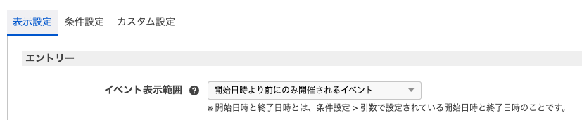
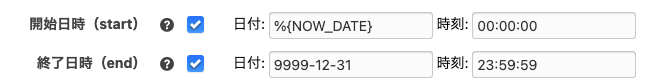
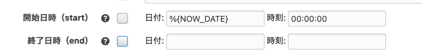
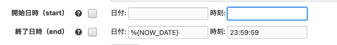
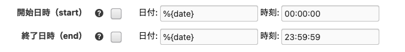

# Event

イベント情報として作成したエントリーを扱うためのモジュールを追加する拡張アプリです。

## 動作環境

- a-blog cms: Ver. 3.2 (3.3+ not tested yet)
- php: 8.1 – 8.4 (8.5+ not tested yet)

## インストール方法

拡張アプリをダウンロード後、zip ファイルを解凍して `extension/plugins/`に設置します。

設置が完了すると、「管理画面->拡張アプリ」に`Event`という名前で本拡張アプリが表示されるので、インストールをクリックしインストールします。

## 使い方

### 準備：イベント用エントリーを作成する

イベント情報として作成するエントリーに、`eventDateFrom`と`eventDateTo`という名前のカスタムフィールドを設定できるようにします。

```html
<!-- 例：admin/entry/field.html -->
<!-- 共通の設定 -->
@include("/admin/entry/field-common.html")

<!-- SEOの設定 -->
@include("/admin/entry/field-seo.html")

<!-- ピックアップの設定 -->
@include("/admin/entry/field-pickup.html")

<!-- コード別フィールドの表示 -->
@include("/admin/entry/ccd/%{CCD}.html") @include("/admin/entry/ecd/%{ECD}")

<!-- Event用フィールドの設定 -->
<h2 class="acms-admin-admin-title2">イベント</h2>

<table class="js-fieldgroup-sortable adminTable acms-admin-table-admin-edit">
  <thead class="acms-admin-hide-sp">
    <tr>
      <th class="acms-admin-table-left acms-admin-admin-config-table-item-handle">&nbsp;</th>
      <th class="acms-admin-table-left">イベント開始日</th>
      <th class="acms-admin-table-left">イベント終了日</th>
      <th class="acms-admin-table-left acms-admin-admin-config-table-action">削除</th>
    </tr>
  </thead>
  <tbody>
    <!-- BEGIN event:loop -->
    <tr class="sortable-item">
      <td class="item-handle">
        <i class="acms-admin-icon-sort"></i>
      </td>
      <td>
        <input
          type="text"
          name="eventDateFrom[]"
          value="{eventDateFrom}"
          class="js-datepicker2 acms-admin-form-width-full"
        />
      </td>
      <td>
        <input
          type="text"
          name="eventDateTo[]"
          value="{eventDateTo}"
          class="js-datepicker2 acms-admin-form-width-full"
        />
      </td>
      <td>
        <button
          type="button"
          class="item-delete acms-admin-btn-admin acms-admin-btn-admin-danger"
        >
          削除
        </button>
      </td>
    </tr>
    <!-- END event:loop -->
    <tr class="sortable-item item-template">
      <td class="item-handle"><i class="acms-admin-icon-sort"></i></td>
      <td>
        <input
          type="text"
          name="eventDateFrom[]"
          value=""
          class="js-datepicker2 acms-admin-form-width-full"
        />
      </td>
      <td>
        <input
          type="text"
          name="eventDateTo[]"
          value=""
          class="js-datepicker2 acms-admin-form-width-full"
        />
      </td>
      <td>
        <button
          type="button"
          class="item-delete acms-admin-btn-admin acms-admin-btn-admin-danger"
        >
          削除
        </button>
      </td>
    </tr>
  </tbody>
  <tfoot>
    <tr>
      <td colspan="4">
        <button
          type="button"
          class="item-insert acms-admin-btn-admin"
        >
          追加
        </button>
      </td>
    </tr>
  </tfoot>
</table>
<p
  class="acms-admin-margin-bottom-small acms-admin-margin-right-mini acms-admin-margin-left-mini acms-admin-margin-top-mini"
>
  ※開催日が1日だけ、もしくは日をまたいでいる場合はイベント終了日に入力せず、イベント開始日のみに入力してください
</p>
<p class="acms-admin-margin-bottom-small acms-admin-margin-right-mini acms-admin-margin-left-mini">
  例）2021/1/1,
  2021/1/3に開催する場合、追加ボタンから入力欄をふやし、1つ目のイベント開始日に2021-01-01を、2つ目のイベント開始日に2021-01-03を入力する。
</p>
<p class="acms-admin-margin-bottom-small acms-admin-margin-right-mini acms-admin-margin-left-mini">
  例）2021/1/1の1日だけ開催する場合、イベント開始日に2021-01-01を入力し、イベント終了日は空欄にする。
</p>
<input type="hidden" name="@event[]" value="eventDateFrom" />
<input type="hidden" name="field[]" value="eventDateFrom" />
<input type="hidden" name="@event[]" value="eventDateTo" />
<input type="hidden" name="field[]" value="eventDateTo" />
<input type="hidden" name="field[]" value="@event" />
```

### 追加モジュールを使用してイベントを表示する

`eventDateFrom`と`eventDateTo`が設定されたエントリーは、下記の GET モジュールを使用して表示できます。追加されるモジュールの概要を説明します。

#### Event_Summary

指定された期間内に存在するイベントを一覧表示するモジュールです。 `Entry_Summaryモジュール`の拡張になります。

使用する場合は、管理画面`モジュールID`からモジュール ID を作成し、以下の設定を行ってください。

- 「表示設定」を行う(設定方法は、Entry_Summary を参考にしてください)
- 「条件設定 > 引数」の開始日時及び終了日時を設定すると、「表示設定 > エントリー > イベント表示範囲」の設定に応じたエントリーが表示されます。

##### スニペット

```html
<!-- BEGIN_MODULE Event_Summary id="" -->
<div class="acms-margin-bottom-medium">
@include("/admin/module/setting.html")
<!-- BEGIN notFound -->
<p>ただいまページを準備しております。もうしばらくお待ちください。</p>
<!-- END notFound -->

<div class="acms-grid">
	<!-- BEGIN unit:loop -->
	<!-- BEGIN entry:loop -->
	<div class="acms-col-md-4 js-autoheight-r"><!-- BEGIN image:veil -->
		<!-- END image:veil --><!-- BEGIN noimage --><!-- END noimage -->
		<h3>{title}</h3>
		<p>{summary}</p>
    <!-- BEGIN event:loop -->
    <p class="summary-detail margin-top-sm">・期間 {eventDateFrom}[date('Y年n月d日')] 〜 {eventDateTo}[date('Y年n月d日')]</p>
    <!-- END event:loop -->
		<p><a href="{url}" class="acms-btn">詳細をみる</a></p>
	</div>
	<!-- END entry:loop -->
	<!-- END unit:loop -->
</div>

<!-- BEGIN pager:veil -->
<div class="acms-text-center">
	<ul class="acms-pager">
		<!-- BEGIN backLink --><li><a href="{url}">« 前の{backNum}件</a></li><!-- END backLink -->
		<!-- BEGIN page:loop --><li{pageCurAttr}[raw]><span><!-- BEGIN link#front --><a href="{url}"><!-- END link#front -->{page}<!-- BEGIN link#rear --></a><!-- END link#rear --></span></li><!-- END page:loop -->
		<!-- BEGIN lastPage:veil --><li><span>...</span></li><li{pageCurAttr}[raw]><span><a href="{lastPageUrl}">{lastPage}</a></span></li><!-- END lastPage:veil -->
		<!-- BEGIN forwardLink --><li><a href="{url}">次の{forwardNum}件 »</a></li><!-- END forwardLink -->
	</ul>
</div>
<!-- END pager:veil -->
</div>
<!-- END_MODULE Event_Summary -->
```

#### Event_ArchiveList

`eventDateFrom` と `eventDateTo` のカスタムフィールドの値を元に年月別アーカイブの URL と件数を表示するモジュールです。表示設定のアーカイブの単位（年・月・日）をまたいでいる場合でもそれぞれのアーカイブの単位ごとに件数をカウントします。

例えば、`eventDateFrom` に 2022-04-01 、 `eventDateTo` に 2022-04-10` を登録したエントリーが存在する場合、表示設定のアーカイブの単位を「日単位」に設定すると、2022-04-01 から 2022-04-10 までのすべての日でイベントの件数をカウントします。

- 「表示設定」を行う(設定方法は、Entry_ArchiveList を参考にしてください)
- 「条件設定 > 引数」の開始日時及び終了日時を設定すると、「表示設定 > エントリー > イベント表示範囲」の設定に応じたエントリーを対象に件数をカウントします。

##### スニペット

```html
<!-- BEGIN_MODULE Event_ArchiveList id="" -->
<div class="acms-margin-bottom-medium">
  @include("/admin/module/setting.html")
  <ul class="acms-list-group">
    <!-- BEGIN archive:loop -->
    <li>
      <a href="{url}" class="acms-list-group-item"
        >{date#Y}年 {date#n}月 <span class="acms-badge acms-float-right">{amount}</span></a
      >
    </li>
    <!-- END archive:loop -->
  </ul>
</div>
<!-- END_MODULE Event_ArchiveList -->
```

#### Event_Calendar

カレンダーに各日に設定されているイベントを表示するモジュールです。 `Entry_Calendarモジュール`の拡張になります。

カスタムフィールドの `eventDateFrom` 、 `eventDateTo` の日付を元にデータを表示してくれる機能に加え Entry_Calendar モジュールと以下の点で異なります。

- イベントが何回目の開催かという loop 変数を追加
- date 変数はイベント開催日の日付を表示
- エントリーのタグを表示可能

##### スニペット

```html
<!-- BEGIN_MODULE Event_Calendar id="" -->
<div>
  <!-- BEGIN date -->
  <ul class="acms-text-center acms-list-inline">
    <li><a href="%{BASE_URL}calendar.html/{prevDate}" class="acms-btn-flat" title="前月へ">«</a></li>
    <li><a href="%{BASE_URL}calendar.html/{year}/{month}" class="acms-btn-flat">{month}月</a></li>
    <li><a href="%{BASE_URL}calendar.html/{nextDate}" class="acms-btn-flat" title="次月へ">»</a></li>
  </ul>
  <!-- END date -->
  <div class="acms-table-responsive">
    <table class="acms-table acms-table-bordered calendarTable">
      <!-- BEGIN week:loop -->
      <!-- BEGIN foreSpacer -->
      <tr class="acms-table-info">
        <th>{prevDay}<span class="text-muted">（{week}）</span></th>
        <td>
          <!-- BEGIN foreEntry:loop -->
          <div>
            開催日: {date#Y}年{date#m}月{date#d}日<!-- BEGIN url#front --><a href="{url}"
              ><!-- END url#front -->{title}{loop}日目<!-- BEGIN url#rear --></a
            ><!-- END url#rear -->
          </div>
          <!-- END foreEntry:loop -->
        </td>
      </tr>
      <!-- END foreSpacer -->
      <!-- BEGIN day:loop -->
      <tr>
        <th class="{today}">{day}<span class="text-muted">（{week}）</span></th>
        <td>
          <<!-- BEGIN entry:loop -->
          <div>
            <!-- BEGIN tag:veil -->
            <!-- BEGIN tag:loop --><a href="{url}">{name}</a
            ><!-- BEGIN glue -->,
            <!-- END glue --><!-- END tag:loop --><!-- END tag:veil -->
            開催日: {date#Y}年{date#m}月{date#d}日<!-- BEGIN url#front --><a href="{url}"
              ><!-- END url#front -->{title}{loop}日目<!-- BEGIN url#rear --></a
            ><!-- END url#rear -->
          </div>
          <!-- END entry:loop -->
        </td>
      </tr>
      <!-- END day:loop -->
      <!-- BEGIN rearSpacer -->
      <tr class="acms-table-info">
        <th>{nextDay}<span class="text-muted">（{week}）</span></th>
        <td>
          <!-- BEGIN rearEntry:loop -->
          <div>
            開催日: {date#Y}年{date#m}月{date#d}日<!-- BEGIN url#front --><a href="{url}"
              ><!-- END url#front -->{title}{loop}日目<!-- BEGIN url#rear --></a
            ><!-- END url#rear -->
          </div>
          <!-- END rearEntry:loop -->
        </td>
      </tr>
      <!-- END rearSpacer -->
      <!-- END week:loop -->
    </table>
  </div>
</div>
<!-- END_MODULE Event_Calendar -->
```

#### Event_Month

月間カレンダーを表示します。イベントが開催される日付にはリンクを付けることができます。

管理画面`モジュールID`からモジュール ID を作成し、以下の設定を行ってください。

- `表示設定`を行う(設定方法は、Calendar_Month を参考にしてください)

##### スニペット

```html
<!-- BEGIN_MODULE Event_Month id="" -->
<section class="module-section">
  @include("/admin/module/setting.html")
  <div>
    <div>
      <h3 class="acms-text-center"><a href="{monthUrl}">{month}月</a></h3>
      <ul class="acms-admin-text-center acms-admin-list-inline">
        <li><a href="{prevUrl}" class="acms-btn-flat" title="前月へ">«</a></li>
        <li><a href="{yearUrl}" class="acms-btn-flat" title="年間カレンダーへ">{year}</a></li>
        <li><a href="{nextUrl}" class="acms-btn-flat" title="次月へ">»</a></li>
      </ul>
    </div>
    <table class="acms-admin-table acms-admin-table-bordered">
      <thead>
        <tr class="acms-admin-text-center">
          <!-- BEGIN weekLabel:loop -->
          <td>{label}</td>
          <!-- END weekLabel:loop -->
        </tr>
      </thead>
      <tbody>
        <!-- BEGIN week:loop -->
        <tr class="acms-admin-text-center">
          <!-- BEGIN day:loop -->
          <!-- BEGIN spacer -->
          <td></td>
          <!-- END spacer -->
          <!-- BEGIN none -->
          <td>{day}</td>
          <!-- END none -->
          <!-- BEGIN link -->
          <td class="success">
            <a href="{url}">{day}<!-- BEGIN_IF [{tag}/eq/today] -->（今日）<!-- END_IF --></a>
          </td>
          <!-- END link -->
          <!-- END day:loop -->
        </tr>
        <!-- END week:loop -->
      </tbody>
    </table>
  </div>
</section>
<!-- END_MODULE Event_Month -->
```

### イベント表示範囲について


Event_Summary 及び Event_ArchiveList モジュールなど Event 拡張アプリで提供されてるモジュールの 1 部の表示設定には、**イベント表示範囲** という項目が追加されています。こちらはモジュール ID 設定の条件設定 > 引数 で指定した「開始日時（start）」、「終了日時（end）」に基づいて参照するエントリーを絞り込むための設定です。

選択できる設定は以下の 3 種類です。

- 開始日時から終了日時の間に開催されるイベント
- 開始日時より前にのみ開催されるイベント
- 終了日時より後にのみ開催されるイベント

それぞれ解説します。

#### 開始日時から終了日時の間に開催されるイベント

イベント表示範囲を、**開始日時から終了日時の間に開催されるイベント**に設定した場合、参照されるエントリーのデータはモジュール ID 設定の条件設定 > 引数で設定した「開始日時（start）」と「終了日時（end）」の間に一度でも開催されるイベントエントリーとなります。

例えば、以下のように「開始日時（start）」と「終了日時（end）」を指定した Event_Summary モジュールで表示されるエントリーは **今日以降に開催されるイベントのエントリー**になります。

※URL コンテキストで年月日を指定している場合には、URL コンテキストの指定が優先されます。



**開始日時から終了日時の間に開催されるイベント**という設定は最も万能で、「開始日時（start）」を `%{NOW_DATE} 00:00:00` 、「終了日時（end）」を `%{NOW_DATE} 23:59:59` に設定することで、今日開催のイベントエントリーのみを表示させることもできます。

#### 開始日時より前にのみ開催されるイベント

イベント表示範囲を、**開始日時より前にのみ開催されるイベント**に設定した場合、参照されるエントリーのデータはモジュール ID 設定の条件設定 > 引数で設定した「開始日時（start）」以降は開催予定がないイベントエントリーとなります。

例えば、以下のように「開始日時（start）」を指定した Event_Summary モジュールで表示されるエントリーは **今日以降に開催される予定がないイベントのエントリー**になります。



#### 終了日時より後にのみ開催されるイベント

イベント表示範囲を、**終了日時より後にのみ開催されるイベント**に設定した場合、参照されるエントリーのデータはモジュール ID 設定の条件設定 > 引数で設定した「終了日時（end）」の時点で開催が 1 度もないイベントエントリーとなります。

例えば、以下のように「終了日時（end）」を指定した Event_Summary モジュールで表示されるエントリーは **今日までに 1 度も開催されていないイベントのエントリー**になります。



### 表示順

Event_Sumamry などの Event 拡張アプリで提供されてるモジュールの 1 部の表示設定には、以下の 4 種類の表示順の設定が追加されています。

- イベント開始日（昇順）
- イベント開始日（降順）
- イベント終了日（昇順）
- イベント終了日（降順）

設定例ですが、表示順を**イベント開始日（昇順）**、第 2 表示順を**イベント終了日（昇順）** に設定すると、イベントの開催が終わった順にエントリーの順番を指定できます。

### イベント表示範囲をクエリストリングで指定する。

モジュール ID の条件設定 > 引数で以下のように「開始日時（start）」と「終了日時（end）」を指定することで、イベント表示範囲をクエリストリングで指定することができます。



イベント表示範囲の設定が「開始日時より前にのみ存在するイベント」かつ、上記の設定、以下の URL でサイトにアクセスすると、2022 年 4 月 20 日のイベントエントリーのデータのみが参照されます。

```
https://example.com/?date=2022-04-20
```

イベント表示範囲をクエリストリングで指定することで、Event_Sumamry モジュールを Event_Month モジュールと併用指定使用する場合に URL コンテキストの年月日の設定は Event_Month モジュールのために指定したいが、Event_Sumamry モジュールのイベント表示範囲を動的に指定したいといった課題を解消することができます。
